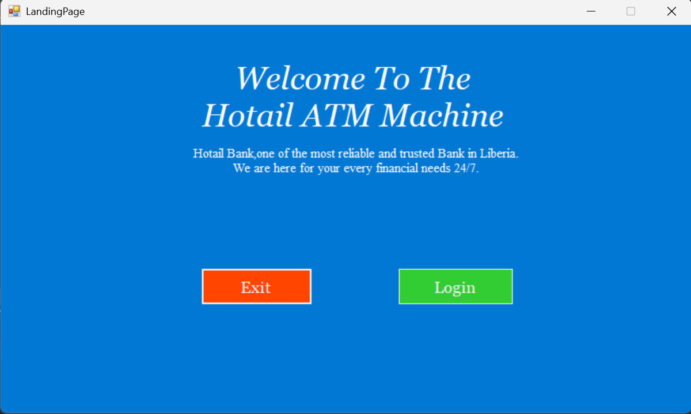
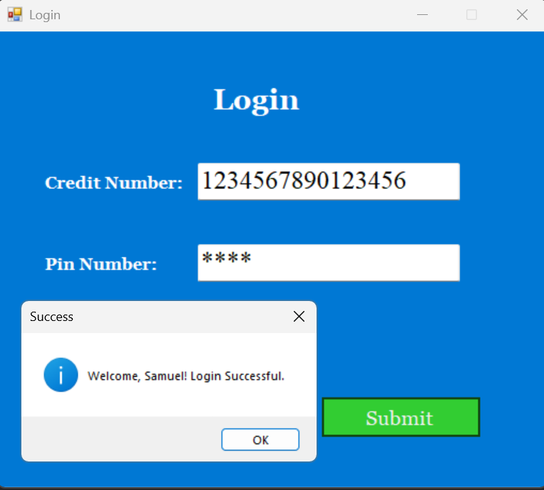
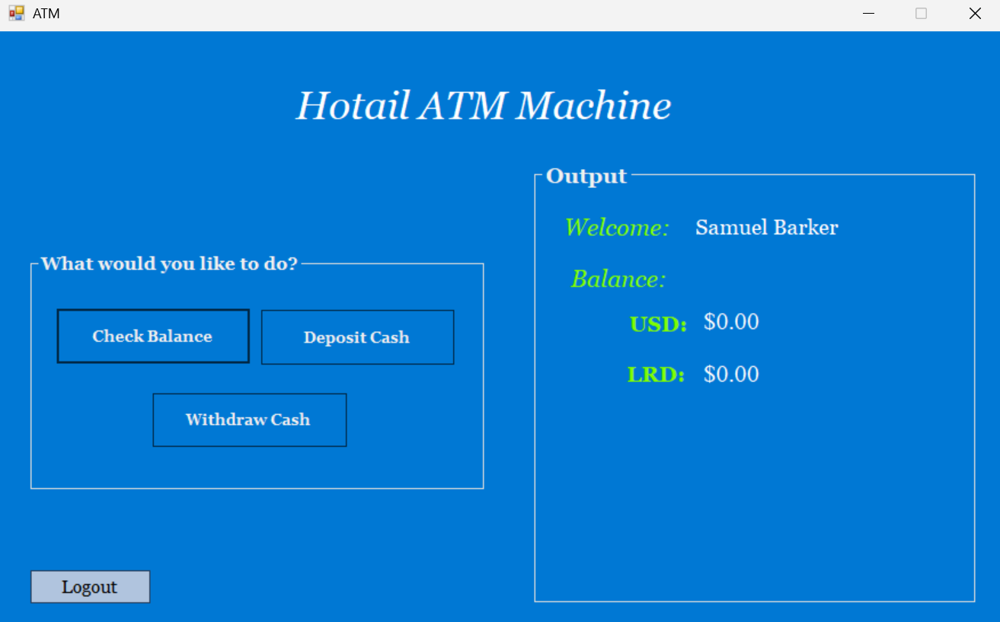

# Hotail ATM Machine Desktop Application

This project was builded using **_C# and Winforms and Mircosoft SQL Server_** in the **_Visual Studio IDE_**. The Hotail ATM system is basic ATM system. It can perform basic ATM functionality like:  

> - Login user
> - Logout user
> - Checking user USD and LRD Accounts  
> - Deposit either USD or LRD into the User Account  
> - Withdrawing either USD or LRD cash from User Account 

This application does not have the feature to register user. It uses fixed data already set in the dataBase.

## Application overview

### Landing Page of Hotail ATM Machine



### Login Page of Hotail ATM Machine




### Main Dashboard



## Setup

### 1. Create your dataBase for the application

The SQL Query used for the database tables is are in the Directory:

> ATM_System\SSMS_SQL_Query

your can edit it as your desire but make your it doesn't break the application. I used the Microsoft SQL server SSMS 21 to create the database and the tables.  
So you must create the Database table first before doing the next step.

### 2. Add the Connection String

In the file:
> ATM_System/Data_repo/ATM_DatabaseRepo.cs

edit this section of the **ATM_DatabaseRepo.cs** file at **_Line 13_** in the class.Place your database connection string in the static attribute.

```C#

namespace ATM_System.Data_repo
{
    public class ATM_DatabaseRepo
    {
        //Edit this with your Connection string.

        private static readonly string ConnectionString = "PUT YOUR CONNECTION STRING";


        // Other code
    }
}

```

### 4.Start the application
Now start the application and use the default login information set already in the SQL or enter in the one your added to the SQL Query if your edited it.
After words you can now work with aplication as you intended.😊

## Notice

### Issues to fix soon

If your run the application and close it using the form Cancel icon ❌. There is a chance the application process will still be running in the background. When you retry to run the application again it won't run because it is still running.

### Solution

To get the application running again you need to open the Task Manager, go the the  Detail section and search for:

> **__atm__**

in the search bar and then right click and click on **__End_Task__**.  
This will get the application running again.So if it happens again just go through this process.

## Enjoy the Application 😊✅  
